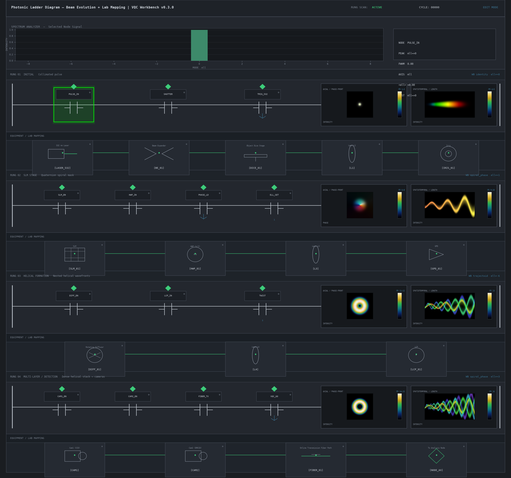
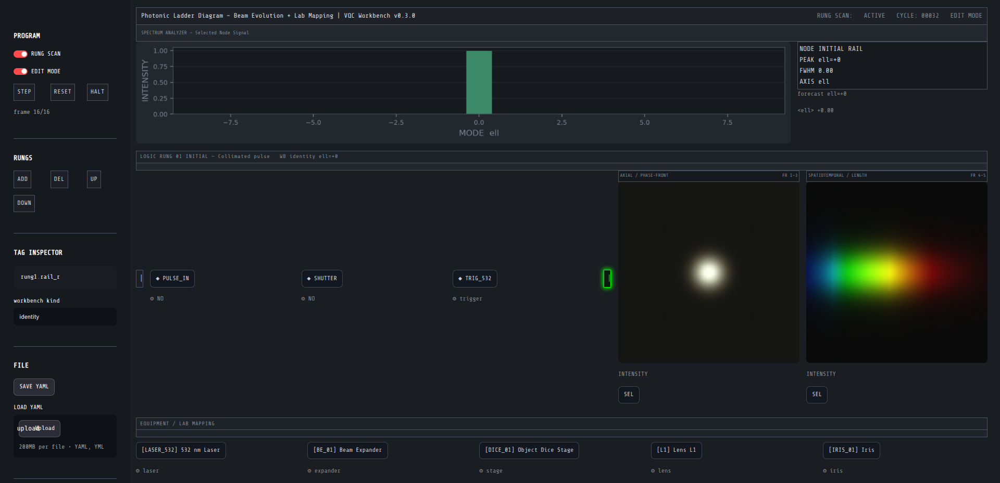

# Photonic Ladder Diagram

PLC / SCADA / HMI workbench for photonic pipelines. Rungs are sequential
stages of the VQC Prototype pulsed-beam evolution; coils are live beam
monitors; a dedicated **EQUIPMENT / LAB MAPPING** strip sits **directly
under** each logic rung (never side-by-side).

```
┌──────────────────────────────────────────────────────────────────┐
│  TITLE / STATUS BAR                                              │
│  Photonic Ladder Diagram – Beam Evolution + Lab Mapping          │
│  | VQC Workbench vX.Y.Z                                          │
│  RUNG SCAN: ACTIVE  •  CYCLE: NNNNN  •  EDIT MODE                │
├──────────────────────────────────────────────────────────────────┤
│  SPECTRUM ANALYZER — Selected Node Signal          (full width)  │
│  Intensity vs ℓ or λ   |   NODE / PEAK ℓ / FWHM                  │
├──────────────────────────────────────────────────────────────────┤
│  LOGIC RUNG 01  (full width)   contacts + dual beam monitors     │
│  EQUIPMENT / LAB MAPPING 01  (full width, never beside logic)    │
├──────────────────────────────────────────────────────────────────┤
│  LOGIC RUNG 02  …                                                │
│  EQUIPMENT / LAB MAPPING 02                                      │
├──────────────────────────────────────────────────────────────────┤
│  …                                                               │
└──────────────────────────────────────────────────────────────────┘
```

## Tech stack

| Layer | Choice | Why |
|-------|--------|-----|
| Data | YAML ladder program (`configs/ladders/`) | Same family as workbench structure YAML; can drive `Workbench()` |
| Engine | Python `LadderEngine` on `Workbench` | Modal OAM, phase masks, propagate, SLM / VQC / HITL |
| Static HMI | matplotlib (`ladder.render`) | Headless industrial mock-up / docs figure / CI |
| Interactive HMI | Streamlit + injected industrial CSS | Already the workbench UI extra; no Electron |
| Beam panels | numpy RGB scientific monitors | Intensity / phase LUTs, not marketing renders |

Not chosen: Qt / Electron / Three.js. The existing Streamlit dashboard
and Python API are the native surface; the ladder is another view of the
same façade, not a second stack.

## Data model

- **Rung** = one beam-evolution stage (`initial`, `slm`, `helical`, `detect`).
- **Contact / tag** = control signal (`NO`, `NC`, `trigger`, `param`).
- **Coil** → two side-by-side monitors: axial / phase-front and
  spatiotemporal / length.
- **Equipment row** = physical bench map with `[TAG]` fields.
- **Selected node** glows `#00FF00` until that node is triggered or
  another node is selected. The spectrum analyzer tracks the selection.

Default program: 16-frame pulsed-beam sequence mapped onto four rungs.

| Rung | Axial (prototype frames) | Spatiotemporal | Workbench kind | Lab mapping |
|------|--------------------------|----------------|----------------|-------------|
| 1 INITIAL | FR 1–3 collimated pulse | FR 4–5 pulse streak | `identity` | 532 nm laser, expander, dice, L1, iris |
| 2 SLM | FR 6–8 vortex / spiral phase | FR 9–10 helical length | `spiral_phase` | SLM, HWP λ/2, L3, GPD |
| 3 HELICAL | FR 11–12 nested wavefronts | FR 13 twisted tubes | `trajectoid` | rotating diffuser, L4, LCP |
| 4 DETECT | FR 14–15 dense rings | FR 16 nested stack | `spiral_phase` ell=3 | Cam1 CCD, Cam2 EMCCD, fiber, analysis node |

## Module map

```
ui/ladder.py  (Streamlit HMI)
ladder/render.py  (static matplotlib HMI)
        │
        ▼
ladder/engine.py  ──► Workbench()  create_structure / simulate_modes /
        │                           export_slm / run_vqc / hitl
        ▼
ladder/model.py   YAML ⇄ LadderDocument
ladder/frames.py  scientific RGB monitors
                  (cached PNGs in assets/beam_monitors/)
```

## Dual-monitor assets (16-frame map)

High-resolution scientific panels (dark bezel, luminous cores, phase /
intensity LUTs) come from `vqc_workbench.ladder.prototype`: Workbench
structures (`spiral_phase` mask × Gaussian), the same LG projector used by
`simulate_modes`, and analytic LG_{0,ℓ} propagation (w(z), Gouy twist) for
the length views. Regenerated by `examples/render_beam_monitors.py` into:

- `src/vqc_workbench/assets/beam_monitors/` (runtime)
- `docs/figures/beam_monitors/` (docs)

| Rung | Axial | Spatiotemporal |
|------|-------|----------------|
| INITIAL | FR 1–3 collimated pulse (`rung1_axial_fr1-3.png`) | FR 4–5 chirped streak (`rung1_st_fr4-5.png`) |
| SLM | FR 6–8 vortex / quaternion phase (`rung2_axial_fr6-8.png`) | FR 9–10 helical tube (`rung2_st_fr9-10.png`) |
| HELICAL | FR 11–12 nested rings (`rung3_axial_fr11-12.png`) | FR 13 layered tubes (`rung3_st_fr13.png`) |
| DETECT | FR 14–15 dense rings (`rung4_axial_fr14-15.png`) | FR 16 nested stack (`rung4_st_fr16.png`) |

Load order: HITL override → cached PNG → procedural fallback. Live cameras
call `LadderEngine.set_hitl_frame(rung_id, axial=, spatiotemporal=)` without
replacing the cache. Static HMI: `docs/figures/ladder_hmi.png`.

`vqc_workbench` still **imports** the ecosystem and never the reverse.
The ladder does not import `vqc_proto/src/photonics.py`.

## Run

```bash
PYTHONPATH=src python3 -m vqc_workbench.cli ladder --render docs/figures/ladder_hmi.png
PYTHONPATH=src python3 -m vqc_workbench.cli ladder --json
PYTHONPATH=src python3 -m vqc_workbench.cli ladder --preset slm_playlist --il
PYTHONPATH=src python3 -m vqc_workbench.cli ladder --port 8502   # Streamlit; needs [ui]
```

Python:

```python
from vqc_workbench.ladder import LadderEngine, beam_evolution_ladder, save_ladder
from vqc_workbench.ladder.render import render_ladder

doc = beam_evolution_ladder()
rt = LadderEngine(grid_size=64).bind(doc)
render_ladder(doc, rt, "outputs/ladder_hmi.png")
save_ladder(doc, "outputs/ladder.yaml")
```

## Walkthrough (node → spectrum → Workbench)

The interactive HMI is a **scrollable stack of all rungs**. Equipment never
shares a row with the logic above it.

**PROGRAM** is a bar directly under the title (not Streamlit’s left
sidebar). Collapse it with the expander chevron; click **PROGRAM** on that
same bar to open it again. Presets, scan, tag inspector, YAML, and
Workbench calls live there.

1. Launch `vqc-workbench ladder` (port 8502). PROGRAM → **LOAD PROTOTYPE SEQUENCE**
   reloads `configs/ladders/beam_evolution.yaml` (four rungs, 16-frame map).
   **LOAD PRESET → slm_playlist** starts with `[SLM_01]` selected.
2. Click a contact (`PULSE_IN`), rail (`L`/`R`), monitor (`AX`/`ST`), or
   equipment tag. The node keeps a `#00FF00` glow until you select another
   node or press **TRIGGER NODE**.
3. The spectrum analyzer follows the selection:
   - laser-class nodes (`[LASER_532]`, `TRIG_532`) → intensity vs wavelength
   - structures, contacts, beam monitors → OAM ℓ spectrum of that rung
   - **AUTO / ell / wl nm** overrides the axis without changing the node
4. Sidebar **WORKBENCH** calls the live façade on the selected rung:
   `simulate_modes`, `export-slm`, `run_vqc`, or HITL playlist.
5. **SAVE YAML** / **EXPORT IL** write the program or a plain-text instruction
   list. **STEP** advances the 16-frame scan; **RUNG SCAN** is status only
   (it does not auto-tick on every click).

Static industrial render (all four rungs):



Live Streamlit capture (Rung 01 with dual monitors + lab mapping):



## Presets

| File | What it loads |
|------|----------------|
| `configs/ladders/beam_evolution.yaml` | Prototype 16-frame sequence, `PULSE_IN` selected |
| `configs/ladders/slm_playlist.yaml` | Same rungs, `[SLM_01]` selected for HITL / export-slm |

## Selection / glow

- Any contact, rail, equipment tag, or beam monitor is a node.
- Selection is single-node. The selected node uses persistent
  `#00FF00` outline + soft outer glow.
- Glow remains until `trigger(node_id)` fires on that node, or another
  node is selected.
- Spectrum analyzer updates to the selected node’s signal: OAM ℓ for
  structures, wavelength for laser-class nodes (`[LASER_532]`, `TRIG_532`).
  Manual **ell / wl nm** override is on the analyzer strip.

## Visual rules (do not break)

- Dark industrial gray, subtle grid, flat panels, sharp corners.
- Classic PLC symbols (open/closed contacts, vertical rails).
- Editable tags with gear marks; green ACTIVE diamonds.
- Accent color only for active / selected (`#00FF00`) and status LEDs.
- Dual beam panels look like lab monitors (scale, frame label, color bar).
- No marketing gloss, no rounded product-card layout.

## Phase gates

1. Architecture + YAML model + this document.
2. Hierarchical layout (title → spectrum → stacked logic+equipment).
3. Dual beam monitors on the right of every logic rung.
4. Equipment rows associated under each rung, full width.
5. Spectrum analyzer + `#00FF00` persistent selection glow.
6. Live `Workbench()` binding (modes, masks, optional SLM / VQC / HITL).
7. Edit / add / delete / reorder rungs; save/load YAML; cycle / scan.
8. Tooltips, README, static figure `docs/figures/ladder_hmi.png`.

## Future

- Multi-user shared ladder programs.
- Live HITL cameras replacing synthetic detect-stage frames (playlist /
  `export-slm` from `[SLM_01]` is already on the Workbench menu).
- Vendor-specific PLC download (the IL export is documentation-grade).
