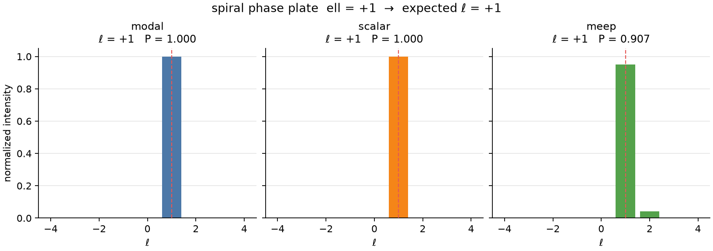
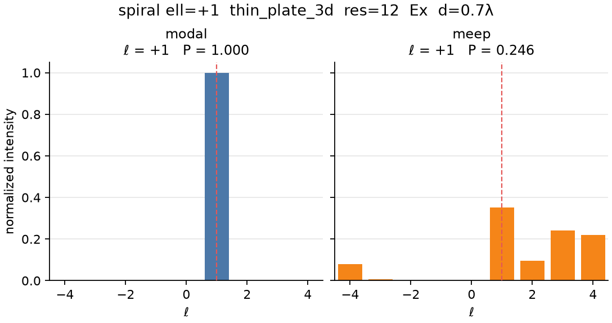

# Meep validation

Companion to [trajectoid.md](trajectoid.md). All FDTD numbers below were
produced with pymeep 1.34 in the `vqc-meep` conda env.

```bash
conda activate vqc-meep
VQC_MEEP_RUN=1 PYTHONPATH=src python examples/meep_validation.py all
```

## 1. Trajectoid resolution sweep (source-imprint)

Canonical cell: `n_trenches=8`, `winding=2`, expected ℓ = −6.
Layout: Gaussian × mask source, 3-D vacuum, DFT Ez downstream.

| res | Dominant ℓ | Purity | cosine vs modal |
|-----|------------|--------|-----------------|
| 16 | −6 | 0.437 | 0.884 |
| 20 | −6 | 0.517 | 0.905 |
| 24 | −6 | 0.604 | 0.953 |
| 32 | −6 | 0.734 | 0.986 |

The charge is correct at every resolution. Purity and cosine tighten
monotonically; res=32 is already publication-usable for the charge claim
(cosine 0.986) even though purity is still 0.73 because of ℓ = −7 leakage.


## 2. Spiral phase plate, ℓ = +1 (source-imprint)

Cheaper cell (`res=12`, extent 3.5). All three backends peak at +1.



| Backend | Dominant ℓ | Purity | cosine vs modal |
|---------|------------|--------|-----------------|
| modal | +1 | 1.000 | — |
| scalar | +1 | 1.000 | 1.000 |
| meep (source-imprint, res=12) | +1 | 0.907 | 0.999 |

|ℓ| = 1 is easy for FDTD: almost no neighbor leakage.

## 3. Dielectric slab (`layout=thin_plate_3d`)

Larger cell and thicker PML (pml=1.2, sz=8). The slab is a true ε(x,y)
MaterialGrid, **not** a source imprint. At the resolutions we can afford
here it does **not** recover the topological charge.

| Cell | res | Expected ℓ | Meep dominant ℓ | cosine vs modal |
|------|-----|------------|-----------------|-----------------|
| spiral ell=+1, extent=5 | 12 | +1 | −4 | 0.151 |
| trajectoid n=8 w=2, extent=6 | 16 | −6 | +8 | 0.006 |

That is an honest negative: a 0.5-thick slab at these pixel counts cannot
hold the helical phase. Source-imprint remains the validated FDTD path.

JSON: [`figures/thin_plate_3d.json`](figures/thin_plate_3d.json).

## 4. Source-imprint gallery (binary, blazed, forked, metasurface)

Same layout as the spiral plate (`res=12`, extent 3.5, 84×84×43 pixels).
Charge plates should peak on the forecast ℓ; 1-D gratings should only
agree in *shape* with the modal projector (⟨ℓ⟩ ≈ 0, no topological charge).

```bash
VQC_MEEP_RUN=1 PYTHONPATH=src python examples/meep_validation.py cells
```

| Cell | Expected ℓ | modal ℓ | Meep ℓ | cosine vs modal | Notes |
|------|------------|---------|--------|-----------------|-------|
| binary grating period=0.4 | 0 | −3 | +3 | 0.883 | No charge; peak sign is noise, ⟨ℓ⟩ ≈ 0 |
| blazed grating period=0.5 | 0 | −4 | −4 | 0.951 | Peak match; ⟨ℓ⟩ still ~0 on modal |
| forked hologram ell=+1 | +1 | −4 | −4 | 0.751 | Linear carrier spreads near-field OAM (demodulate to recover ℓ) |
| metasurface ell_target=+1 | +1 | +1 | +1 | 0.999 | Same as the spiral plate (purity 0.907) |

The metasurface helical-bias cell is a second charge-correct source-imprint
confirmation. Forked holograms agree on the *projector* spectrum, not the
forecast ℓ — same near-field caveat as the modal engine.

Figures: [`binary_grating_backend_spectra.png`](figures/binary_grating_backend_spectra.png),
[`blazed_grating_backend_spectra.png`](figures/blazed_grating_backend_spectra.png),
[`forked_hologram_backend_spectra.png`](figures/forked_hologram_backend_spectra.png),
[`metasurface_backend_spectra.png`](figures/metasurface_backend_spectra.png).
JSON: [`figures/meep_cells.json`](figures/meep_cells.json).

## 5. Dielectric slab encoding (`full_2pi`)

The old map `n = clip(1 + φ λ / 2π d)` sent negative helix onto vacuum.
The default is now

\[
n(\varphi) = n_\mathrm{lo} + (n_\mathrm{hi}-n_\mathrm{lo})\,\frac{\varphi \bmod 2\pi}{2\pi},
\quad (n_\mathrm{hi}-n_\mathrm{lo})\,d = \lambda
\]

so a 2π plate is not clipped.

**Charge-correct defaults** (res=12, ~30 s): transverse **Ex**, `n(x,y)` via a
position-dependent Medium (not a transposed MaterialGrid), `d = 0.7λ`,
`n ∈ [1, 2.43]`, soft disk. Spiral ℓ=+1 **peaks at +1**, cosine vs modal 0.709,
⟨ℓ⟩ ≈ 1.80. Source-imprint is still cleaner (cosine 0.999); the slab is the
Maxwell plate.



JSON: [`figures/spiral_thin_plate_charge.json`](figures/spiral_thin_plate_charge.json).

`slab_encoding="legacy"` restores the old clipped map. `component="Ez"` is
longitudinal for +z and does not imprint a paraxial helix.

JSON: [`figures/thin_plate_3d_hires.json`](figures/thin_plate_3d_hires.json).

## 5b. Higher-res dielectric slab (still a negative)

Smaller cell than §3 (extent 3.5, sz=6, pml=1.0) so res can go up.

| Cell | res | n(φ) | Meep ℓ | cosine vs modal |
|------|-----|------|--------|-----------------|
| spiral ell=+1 | 16 | 1 + clip (legacy) | −4 | 0.113 |
| spiral ell=+1 | 20 | 1 + clip | −4 | 0.096 |
| spiral ell=+1 | 16 | n0=1.5 ± 0.4 φ/π | −4 | 0.098 |
| spiral ell=+1 | 16 | **full_2π**, 3-px plate | +4 | 0.085 |

Raising resolution made cosine **worse**, not better. Centering the index
so negative phase is not vacuum also failed at res=16. Source-imprint is
still the validated FDTD path. `layout=thin_plate_3d` accepts `slab_n0`
and `slab_dn` for later encoding experiments.

```bash
VQC_MEEP_RUN=1 PYTHONPATH=src python examples/meep_validation.py slab-hires --resolutions 16,20
```

JSON: [`figures/thin_plate_3d_hires.json`](figures/thin_plate_3d_hires.json).
