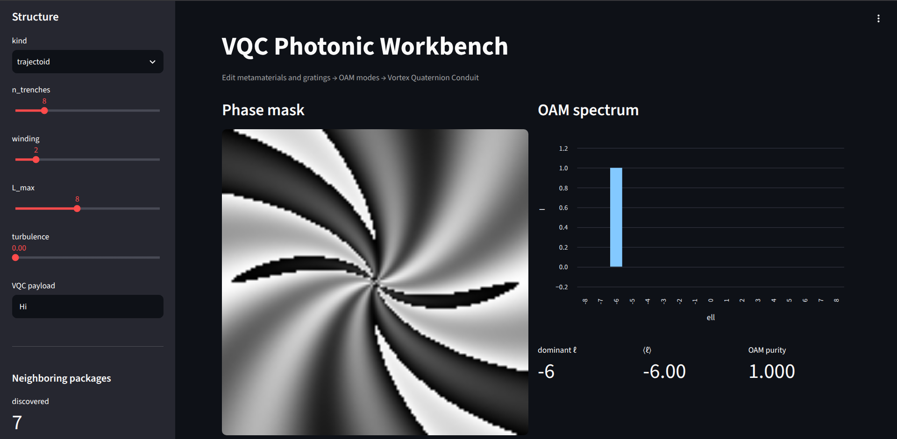
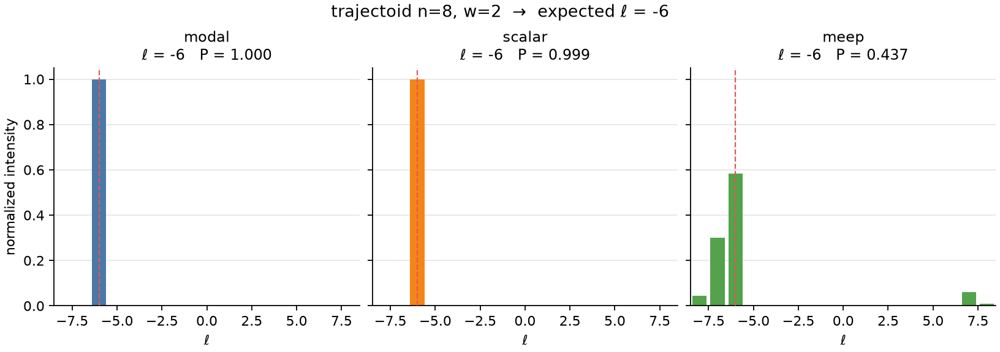
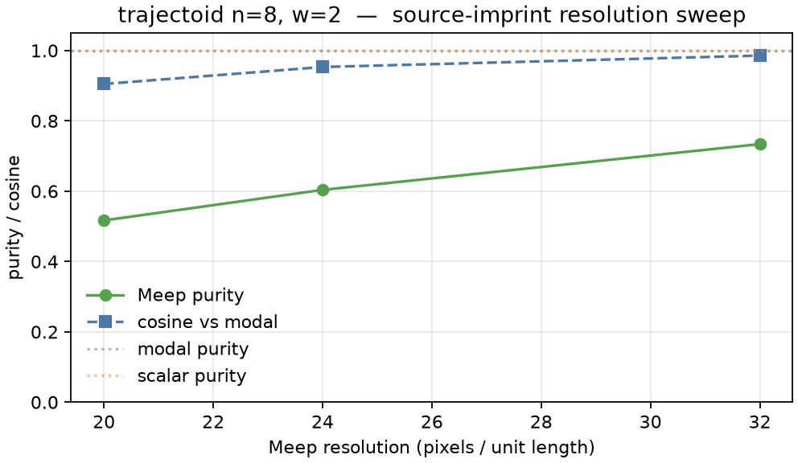

# Trajectoid walkthrough

The analytic trajectoid cell is a **pure mode shifter**. The dashboard makes
the arithmetic visible.



## What you are looking at

| Control | Value in the screenshot | Role |
|---------|-------------------------|------|
| `kind` | `trajectoid` | Rolling-path trench shell (analytic fallback) |
| `n_trenches` | 8 | Azimuthal cosine order in the trench |
| `winding` | 2 | Helical carrier `exp(i w φ)` |
| `L_max` | 8 | OAM ladder wide enough to see \|ℓ\| = 6 |
| turbulence | 0 | Coherent peak; raise it (with live toggle) to watch purity drop |

**Phase mask.** Multi-arm spiral / trench pattern — `n_trenches` arms wrapped
by the helical carrier.

**OAM spectrum.** A single bar at ℓ = −6, purity 1.000. That is not a bug
and not scrambling. The optic is adding a topological charge.

## The arithmetic

The thin-element mask is

\[
T(\rho,\varphi) = \exp\!\bigl(i\,[w\,\varphi + a\cos(n\varphi + \psi(\rho))]\bigr)
\]

with \(a = \pi/2\) at the default trench depth. Jacobi–Anger expands this as

\[
e^{i a \cos(n\varphi)}\,e^{i w \varphi}
= \sum_k J_k(a)\,e^{i(w + k n)\varphi}.
\]

\(|J_1(\pi/2)|\) dominates \(|J_0|\), so the strongest charges are
\(w \pm n\). The Gaussian aperture plus the log-radial trench bias selects
the **minus** branch:

```text
ℓ = winding − n_trenches = 2 − 8 = −6
```

The dashboard prints that formula under the spectrum as **expected ℓ** and
flags a match when the measured peak agrees.

```bash
PYTHONPATH=src python3 -m vqc_workbench.cli simulate --kind trajectoid --n-trenches 8 --winding 2
```

## Payload recovery

Because this is a shifter, `run_vqc` through the raw shell will not round-trip
a payload. Use the identity channel, or invert the optic:

```bash
PYTHONPATH=src python3 -m vqc_workbench.cli run-vqc --kind trajectoid --payload Hi --compensate
```

On the dashboard the **Compensate (matched filter)** button is primary whenever
`forecast_charge` marks the structure as a mode shifter (spiral, trajectoid,
forked hologram, flux lattice, …).

## Live turbulence

Turn on **Live turbulence on spectrum** and drag the slider. The Kolmogorov
screen is applied to the displayed field (fixed seed), so purity falls while
the phase mask itself stays the same. A **live purity** metric and sparkline
appear in the sidebar; the spectrum footer reads
“Live Kolmogorov screen active — purity is no longer expected to be 1.0”.
VQC runs always use the slider value whether or not the live toggle is on.

## Modal / scalar / Meep

The first full-wave proof is a three-column OAM spectrum on this same cell
(`n_trenches=8`, `winding=2`, expected ℓ = −6):



| Backend | Role | Dominant ℓ | Notes |
|---------|------|------------|--------|
| **modal** | Thin-element LG (fast path) | −6 | Purity ≈ 1 |
| **scalar** | Angular-spectrum, `z=0` | −6 | Cosine = 1 with modal |
| **meep** | 3-D FDTD, source = Gaussian × mask, DFT Ez downstream | −6 | Neighbor leakage to ℓ = −7 at res=16; ⟨ℓ⟩ ≈ −5.5 |

Meep here is a **source-imprint** run: the plate is applied as a complex
source, then the field is DFT-monitored after vacuum propagation. That is a
real FDTD field going through the same OAM projector — not the analytic
mask multiplied back in.

### Resolution sweep (source-imprint)

Purity and modal-cosine both climb with resolution; the dominant charge
stays ℓ = −6 at every point.



| res | Dominant ℓ | Purity | cosine vs modal | n_pixels (nx×ny×nz) |
|-----|------------|--------|-----------------|---------------------|
| 16 | −6 | 0.437 | 0.884 | 144×144×58 |
| 20 | −6 | 0.517 | 0.905 | 180×180×72 |
| 24 | −6 | 0.604 | 0.953 | 216×216×86 |
| 32 | −6 | 0.734 | 0.986 | 288×288×115 |

JSON: [`figures/trajectoid_meep_resolution_sweep.json`](figures/trajectoid_meep_resolution_sweep.json).

### Dielectric slab (`thin_plate_3d`)

Larger cell (extent 6, sz 8) and thicker PML (1.2) still **do not** recover
ℓ = −6 at res=16: Meep peaks at ℓ = +8, cosine vs modal ≈ 0.08. The
source-imprint path is the validated FDTD layout for this cell until the
slab is run at substantially higher resolution.

Regenerate:

```bash
conda activate vqc-meep   # pymeep 1.34 from conda-forge
VQC_MEEP_RUN=1 PYTHONPATH=src python examples/compare_trajectoid_backends.py
VQC_MEEP_RUN=1 PYTHONPATH=src python examples/meep_validation.py all
```

JSON sidecar: [`figures/trajectoid_backend_spectra.json`](figures/trajectoid_backend_spectra.json).
The Meep extras record `layout`, `resolution`, `cell_size`, `n_pixels`, `pml`, and monitor positions so a later “why is purity 0.44?” is answered from that file.

Companion cells (spiral plate + slab details): [meep_validation.md](meep_validation.md).
